# Voiceboard

Voiceboard is a game screen for in-car voice assistants. The assistant hosts by voice and opens a new URL at every step, and the page draws whatever the query string describes. Any assistant that can open a link can host, and the design follows in-car interfaces, with a CarPlay-style sidebar.

It ships as a WordPress plugin that serves the board at `/board/`, and it also runs as plain static files.

## Try it

Each screenshot is one screen, exactly as an assistant would open it. Click one to open it live.

<!-- examples:start -->
<table>
<tr><td width="50%" valign="top"><a href="https://voiceboardgames.com/board/">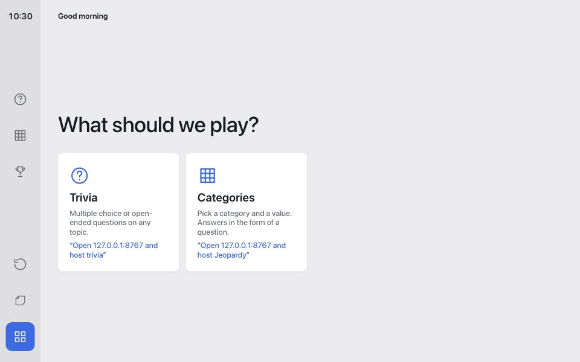</a><br><a href="https://voiceboardgames.com/board/">Home</a></td><td width="50%" valign="top"><a href="https://voiceboardgames.com/board/?g=trivia&st=ask&t=Space&n=3&of=10&q=Which+planet+has+the+most+known+moons%3F&c=Jupiter|Saturn|Uranus|Neptune&p=Joe:200,Sam:100&timer=15">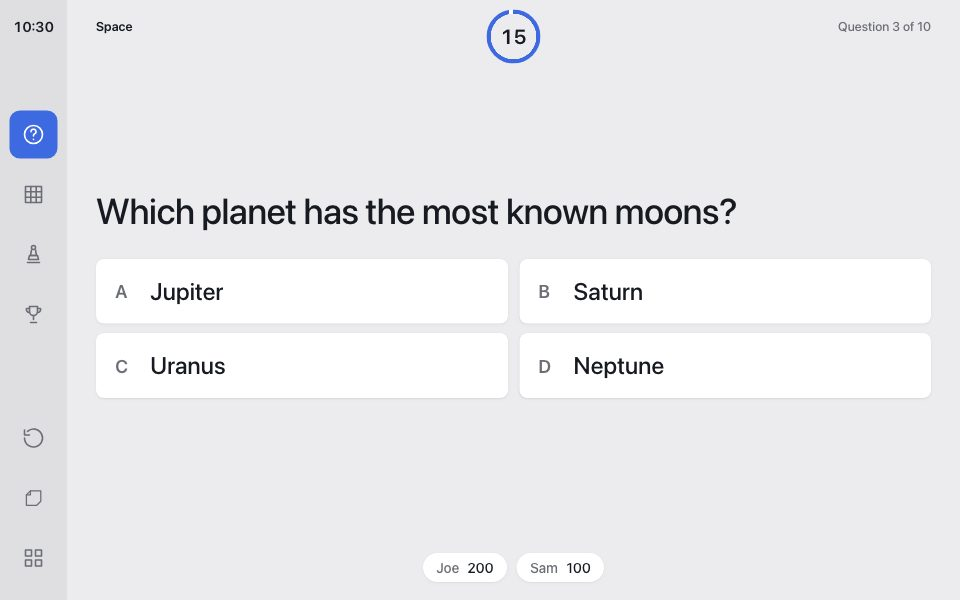</a><br><a href="https://voiceboardgames.com/board/?g=trivia&st=ask&t=Space&n=3&of=10&q=Which+planet+has+the+most+known+moons%3F&c=Jupiter|Saturn|Uranus|Neptune&p=Joe:200,Sam:100&timer=15">Space trivia with a 15-second countdown</a></td></tr>
<tr><td width="50%" valign="top"><a href="https://voiceboardgames.com/board/?g=trivia&st=reveal&t=Space&n=3&of=10&q=Which+planet+has+the+most+known+moons%3F&c=Jupiter|Saturn|Uranus|Neptune&a=B&r=Sam&p=Joe:200,Sam:200">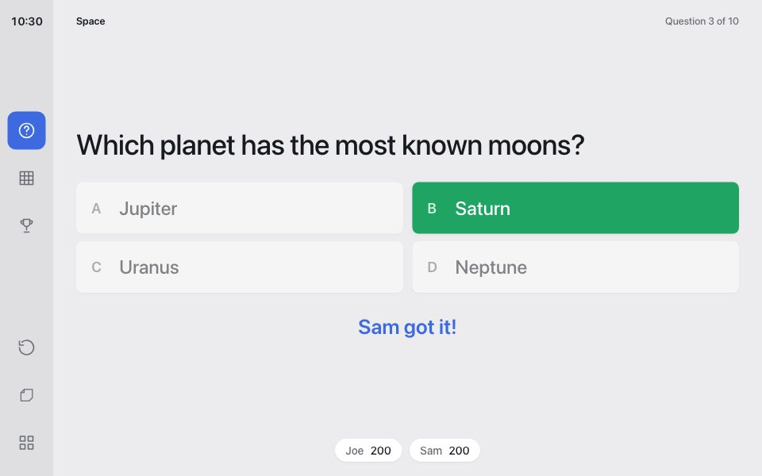</a><br><a href="https://voiceboardgames.com/board/?g=trivia&st=reveal&t=Space&n=3&of=10&q=Which+planet+has+the+most+known+moons%3F&c=Jupiter|Saturn|Uranus|Neptune&a=B&r=Sam&p=Joe:200,Sam:200">The reveal: Sam got it</a></td><td width="50%" valign="top"><a href="https://voiceboardgames.com/board/?g=trivia&st=next&up=Joe&t=Space&n=4&of=10&p=Joe:200,Sam:300,Ava:100">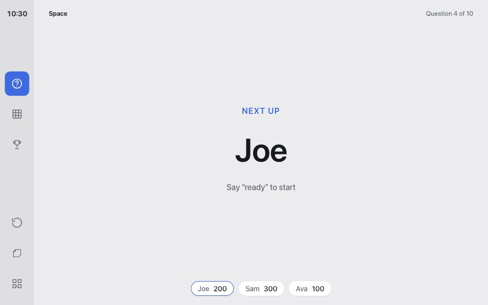</a><br><a href="https://voiceboardgames.com/board/?g=trivia&st=next&up=Joe&t=Space&n=4&of=10&p=Joe:200,Sam:300,Ava:100">Next up: Joe, say ready</a></td></tr>
<tr><td width="50%" valign="top"><a href="https://voiceboardgames.com/board/?g=trivia&st=ask&lang=es&t=Arte&n=2&of=5&q=¿Quién+pintó+la+Mona+Lisa%3F&c=Leonardo+da+Vinci|Miguel+Ángel|Rafael|Botticelli&up=Lucía&p=Lucía:100,Mateo:200&timer=15">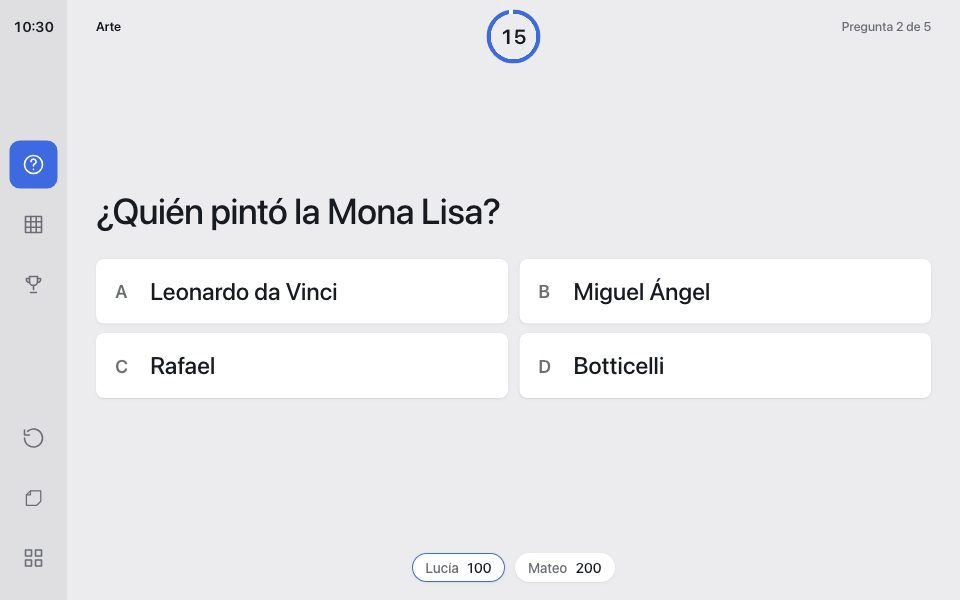</a><br><a href="https://voiceboardgames.com/board/?g=trivia&st=ask&lang=es&t=Arte&n=2&of=5&q=¿Quién+pintó+la+Mona+Lisa%3F&c=Leonardo+da+Vinci|Miguel+Ángel|Rafael|Botticelli&up=Lucía&p=Lucía:100,Mateo:200&timer=15">Spanish: ¿Quién pintó la Mona Lisa?</a></td><td width="50%" valign="top"><a href="https://voiceboardgames.com/board/?g=trivia&st=reveal&lang=ar&t=الفضاء&q=ما+هو+أكبر+كوكب+في+المجموعة+الشمسية؟&c=المشتري|زحل|الأرض|المريخ&a=A&r=سارة&p=سارة:300,عمر:200">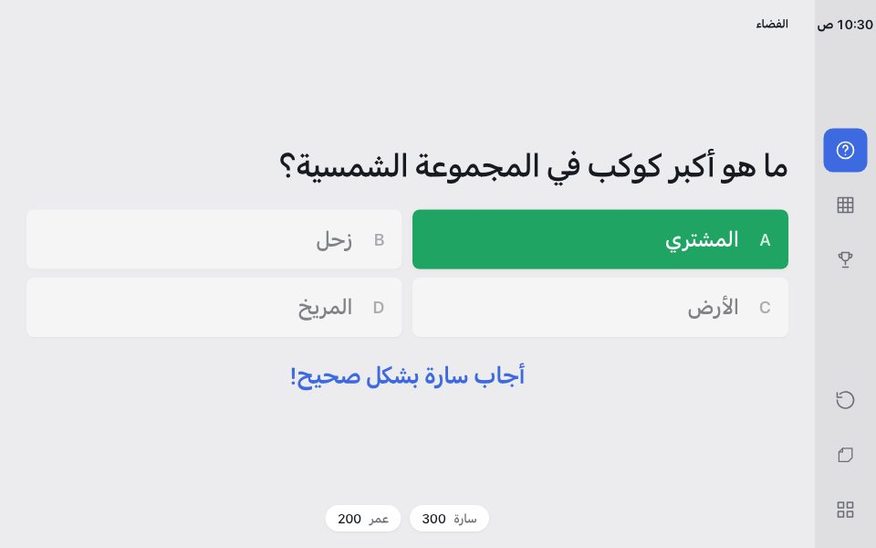</a><br><a href="https://voiceboardgames.com/board/?g=trivia&st=reveal&lang=ar&t=الفضاء&q=ما+هو+أكبر+كوكب+في+المجموعة+الشمسية؟&c=المشتري|زحل|الأرض|المريخ&a=A&r=سارة&p=سارة:300,عمر:200">Arabic, right to left</a></td></tr>
<tr><td width="50%" valign="top"><a href="https://voiceboardgames.com/board/?g=jeopardy&st=board&lang=ja&cats=宇宙|日本の歴史|アニメ|食べ物&u=A1,C2&at=B3&p=ハル:400,ユキ:200">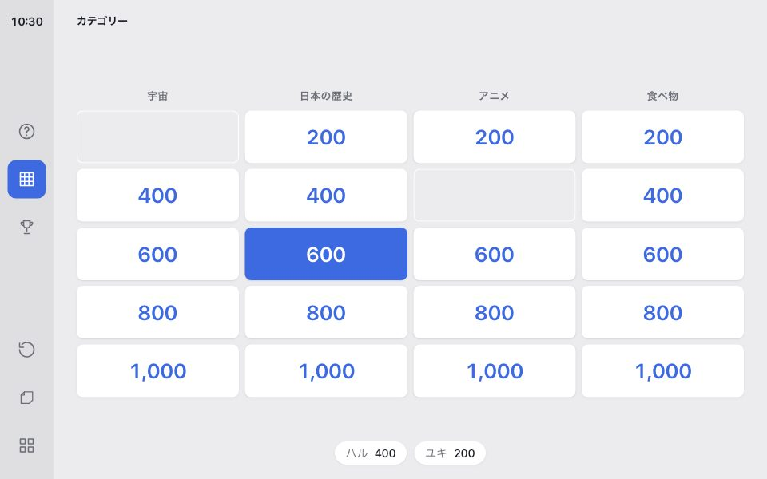</a><br><a href="https://voiceboardgames.com/board/?g=jeopardy&st=board&lang=ja&cats=宇宙|日本の歴史|アニメ|食べ物&u=A1,C2&at=B3&p=ハル:400,ユキ:200">Japanese category board</a></td><td width="50%" valign="top"><a href="https://voiceboardgames.com/board/?g=trivia&st=ask&t=Emoji+Movies&q=🦁👑&c=The+Lion+King|Madagascar|Zootopia|Tarzan&timer=20">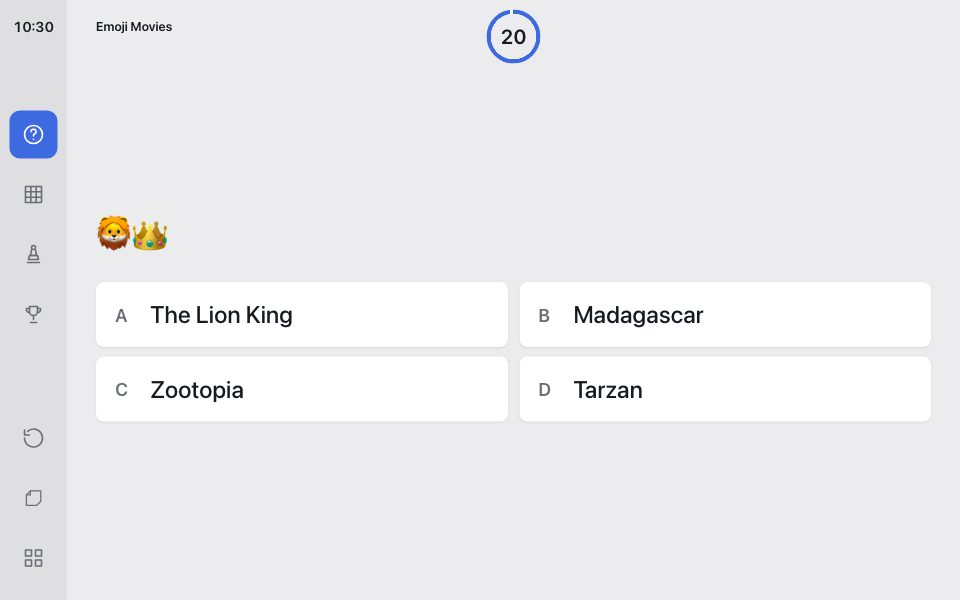</a><br><a href="https://voiceboardgames.com/board/?g=trivia&st=ask&t=Emoji+Movies&q=🦁👑&c=The+Lion+King|Madagascar|Zootopia|Tarzan&timer=20">Name that movie in emoji</a></td></tr>
<tr><td width="50%" valign="top"><a href="https://voiceboardgames.com/board/?g=trivia&st=reveal&t=History&q=Who+was+the+first+person+in+space%3F&a=Yuri+Gagarin&r=none&p=Joe:300,Sam:300">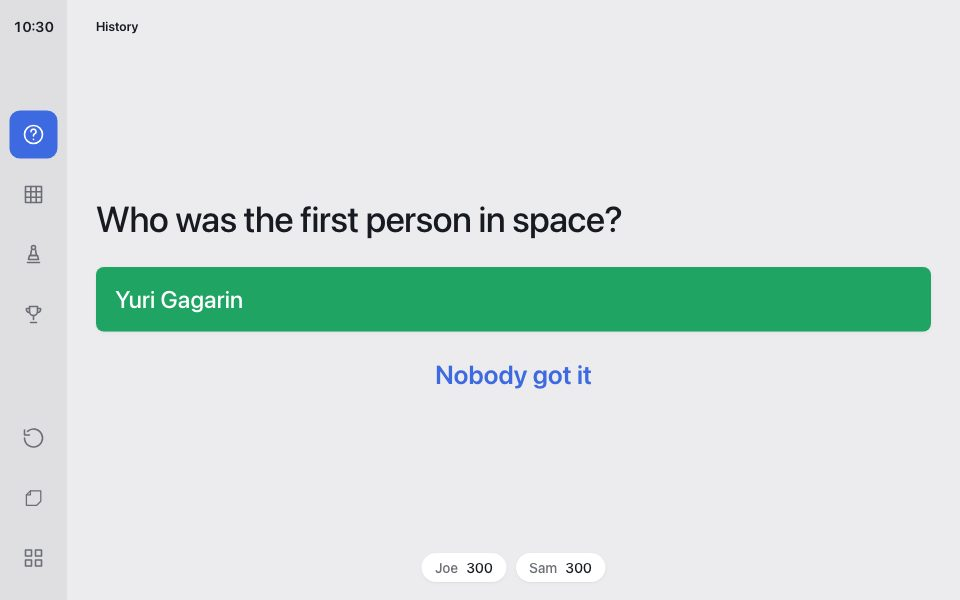</a><br><a href="https://voiceboardgames.com/board/?g=trivia&st=reveal&t=History&q=Who+was+the+first+person+in+space%3F&a=Yuri+Gagarin&r=none&p=Joe:300,Sam:300">Open-ended, and nobody got it</a></td><td width="50%" valign="top"><a href="https://voiceboardgames.com/board/?g=trivia&st=ask&t=Quick+Math&q=7+×+8+%3D+%3F&c=54|56|58|64&p=Mia:2,Leo:3&timer=10">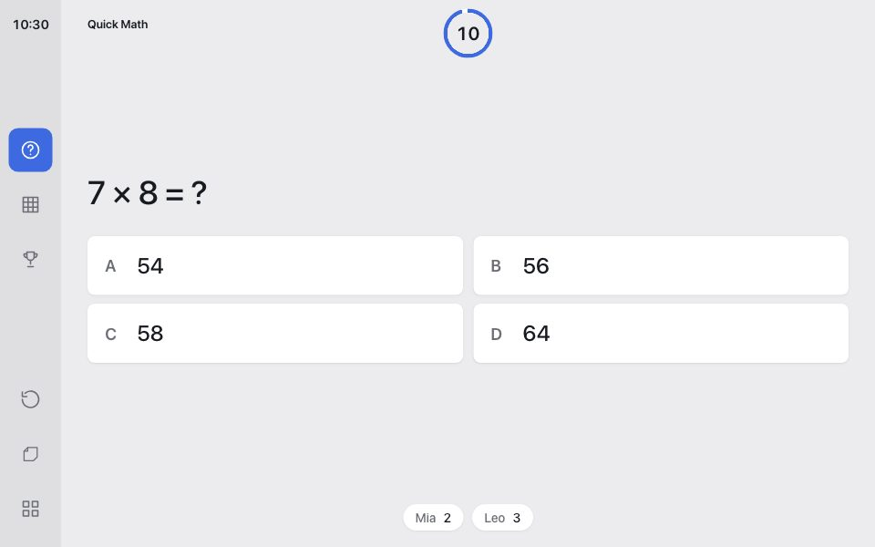</a><br><a href="https://voiceboardgames.com/board/?g=trivia&st=ask&t=Quick+Math&q=7+×+8+%3D+%3F&c=54|56|58|64&p=Mia:2,Leo:3&timer=10">Kids' round: quick math</a></td></tr>
<tr><td width="50%" valign="top"><a href="https://voiceboardgames.com/board/?g=jeopardy&st=board&cats=Space|Rivers|80s+Movies|Food|Sports|Words&u=A1,C3,F5,B2&at=D4&p=Joe:400,Sam:-200,Ava:1200">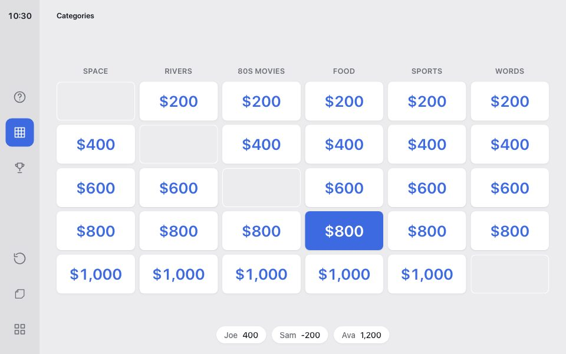</a><br><a href="https://voiceboardgames.com/board/?g=jeopardy&st=board&cats=Space|Rivers|80s+Movies|Food|Sports|Words&u=A1,C3,F5,B2&at=D4&p=Joe:400,Sam:-200,Ava:1200">Jeopardy board mid-game</a></td><td width="50%" valign="top"><a href="https://voiceboardgames.com/board/?g=jeopardy&st=clue&cats=Space|Rivers|80s+Movies|Food|Sports|Words&at=B3&q=This+river+flows+through+Cairo&dd=1&timer=10&p=Joe:400,Sam:-200,Ava:1200">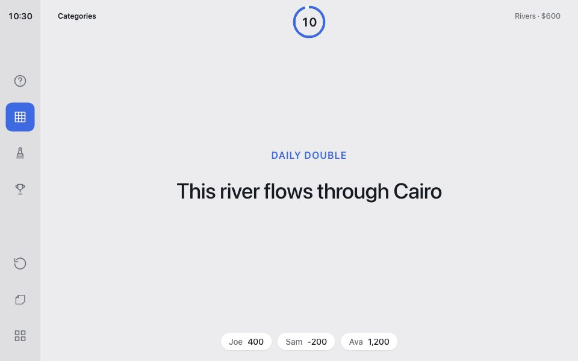</a><br><a href="https://voiceboardgames.com/board/?g=jeopardy&st=clue&cats=Space|Rivers|80s+Movies|Food|Sports|Words&at=B3&q=This+river+flows+through+Cairo&dd=1&timer=10&p=Joe:400,Sam:-200,Ava:1200">Daily Double!</a></td></tr>
<tr><td width="50%" valign="top"><a href="https://voiceboardgames.com/board/?g=jeopardy&st=final&t=Final+Jeopardy&q=This+planet+has+the+tallest+volcano+in+the+solar+system&a=What+is+Mars%3F&r=Ava&w=Joe:400,Ava:1200&p=Joe:0,Ava:2400">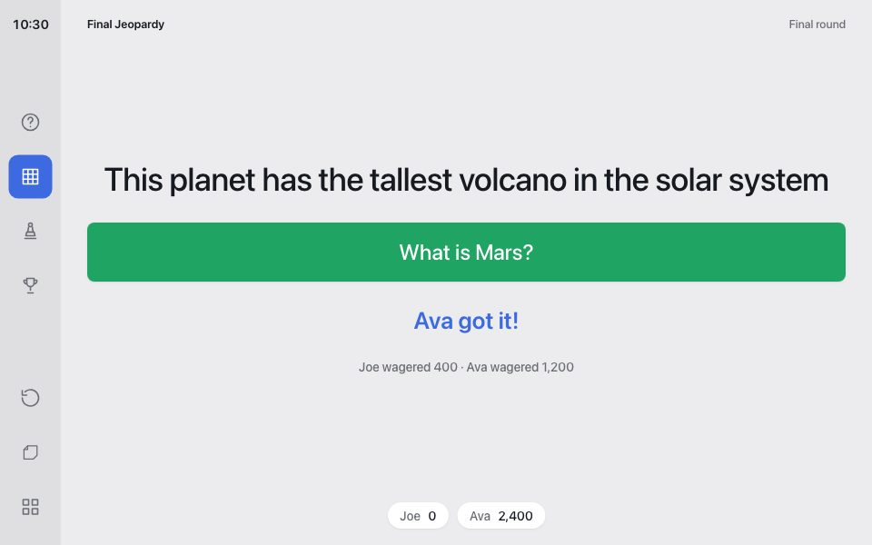</a><br><a href="https://voiceboardgames.com/board/?g=jeopardy&st=final&t=Final+Jeopardy&q=This+planet+has+the+tallest+volcano+in+the+solar+system&a=What+is+Mars%3F&r=Ava&w=Joe:400,Ava:1200&p=Joe:0,Ava:2400">Final Jeopardy with wagers</a></td><td width="50%" valign="top"><a href="https://voiceboardgames.com/board/?g=trivia&st=end&t=Road+Trip+Trivia&p=Joe:500,Sam:500,Ava:300">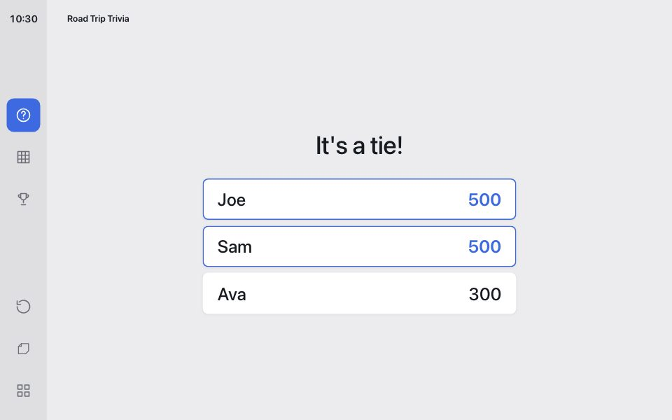</a><br><a href="https://voiceboardgames.com/board/?g=trivia&st=end&t=Road+Trip+Trivia&p=Joe:500,Sam:500,Ava:300">Dead heat</a></td></tr>
<tr><td width="50%" valign="top"><a href="https://voiceboardgames.com/board/?g=trivia&st=end&t=Space&p=Joe:300,Sam:500,Ava:400,Max:250,Lee:450,Kim:100&fx=confetti">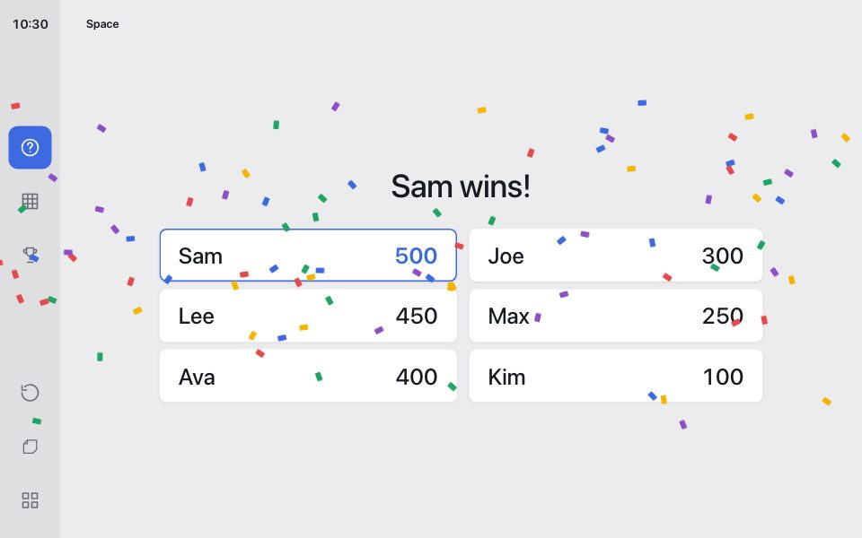</a><br><a href="https://voiceboardgames.com/board/?g=trivia&st=end&t=Space&p=Joe:300,Sam:500,Ava:400,Max:250,Lee:450,Kim:100&fx=confetti">Six-player finale with confetti</a></td><td width="50%" valign="top"><a href="https://voiceboardgames.com/board/?g=jeopardy&st=board&cats=Robots|Space|Synthwave|Hackers|Neon|Future&u=A1,D2&at=C3&p=Neo:800,Trinity:1200,Morpheus:400&theme=cyber">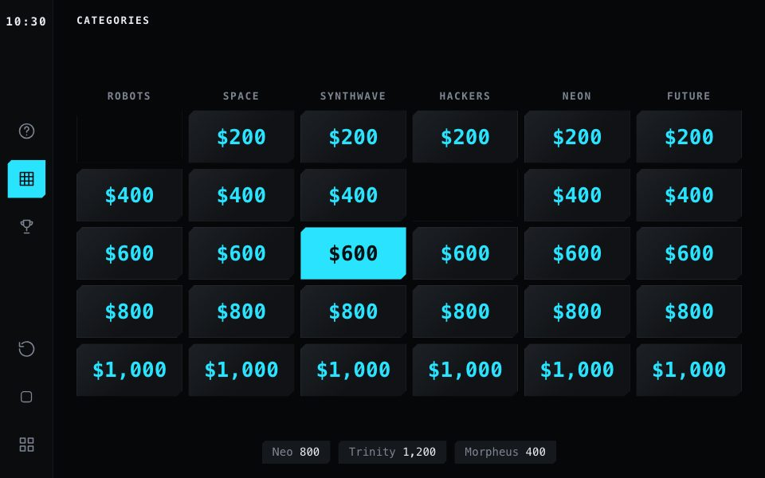</a><br><a href="https://voiceboardgames.com/board/?g=jeopardy&st=board&cats=Robots|Space|Synthwave|Hackers|Neon|Future&u=A1,D2&at=C3&p=Neo:800,Trinity:1200,Morpheus:400&theme=cyber">Cyber theme: neon Jeopardy board</a></td></tr>
<tr><td width="50%" valign="top"><a href="https://voiceboardgames.com/board/?g=trivia&st=ask&t=Sci-Fi&q=What+year+does+Blade+Runner+take+place%3F&c=2019|2049|2077|2001&timer=10&p=Neo:300,Trinity:400&theme=cyber">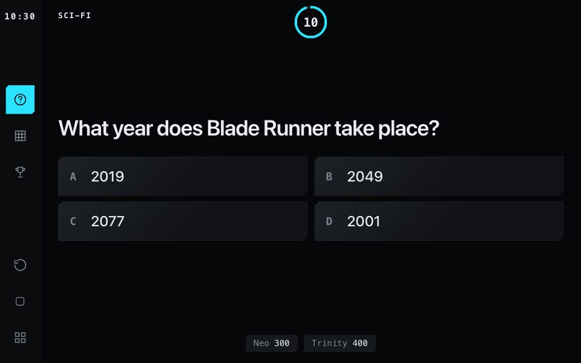</a><br><a href="https://voiceboardgames.com/board/?g=trivia&st=ask&t=Sci-Fi&q=What+year+does+Blade+Runner+take+place%3F&c=2019|2049|2077|2001&timer=10&p=Neo:300,Trinity:400&theme=cyber">Cyber theme: final answer, 10 seconds</a></td><td width="50%" valign="top"><a href="https://voiceboardgames.com/board/?g=trivia&st=ask&t=Around+the+World&q=Which+country+has+a+national+anthem+with+no+official+lyrics%3F&c=Spain|Brazil|Japan|Canada&p=Mia:0,Leo:0">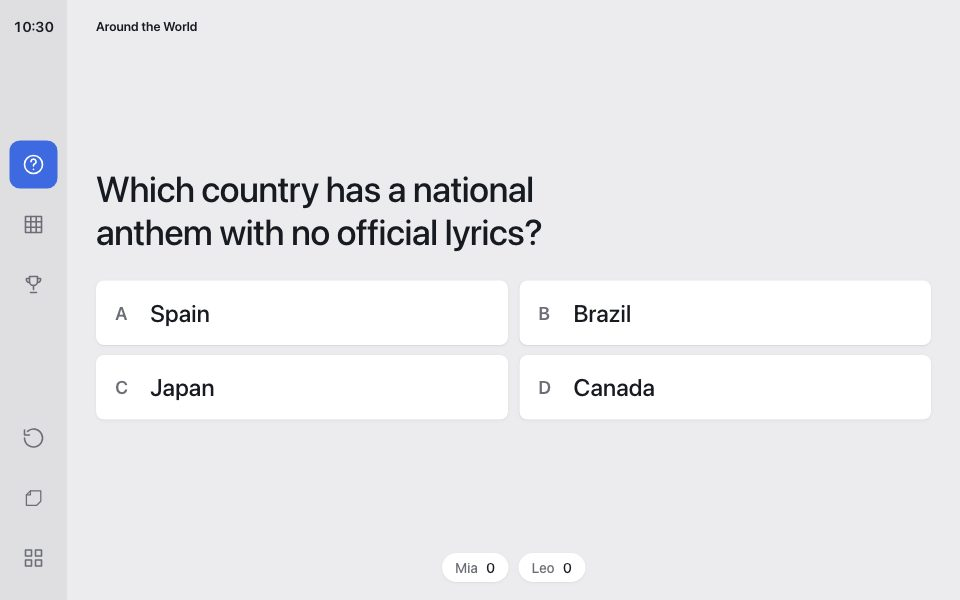</a><br><a href="https://voiceboardgames.com/board/?g=trivia&st=ask&t=Around+the+World&q=Which+country+has+a+national+anthem+with+no+official+lyrics%3F&c=Spain|Brazil|Japan|Canada&p=Mia:0,Leo:0">Guess the national anthem's country</a></td></tr>
<tr><td width="50%" valign="top"><a href="https://voiceboardgames.com/board/?g=trivia&st=ask&t=Road+Trip&q=Which+state+is+home+to+the+Grand+Canyon%3F&c=Utah|Nevada|Arizona|Colorado&timer=15">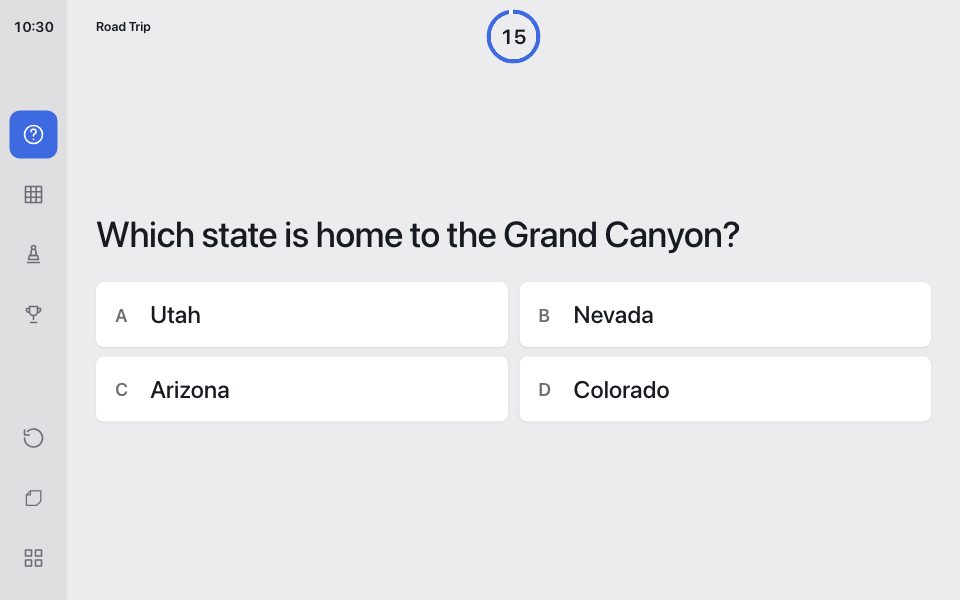</a><br><a href="https://voiceboardgames.com/board/?g=trivia&st=ask&t=Road+Trip&q=Which+state+is+home+to+the+Grand+Canyon%3F&c=Utah|Nevada|Arizona|Colorado&timer=15">Road trip: which state is this?</a></td><td width="50%" valign="top"><a href="https://voiceboardgames.com/board/?g=trivia&st=ask&t=Emoji+Food&q=🌭+🔥+⚾&c=Ballpark+frank|Campfire+cookout|Chili+dog|Corn+dog">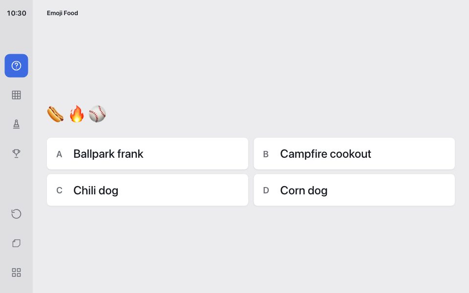</a><br><a href="https://voiceboardgames.com/board/?g=trivia&st=ask&t=Emoji+Food&q=🌭+🔥+⚾&c=Ballpark+frank|Campfire+cookout|Chili+dog|Corn+dog">Emoji food rebus</a></td></tr>
<tr><td width="50%" valign="top"><a href="https://voiceboardgames.com/board/?g=trivia&st=reveal&t=Dad+Jokes&q=Why+don't+skeletons+fight+each+other%3F&a=They+don't+have+the+guts&r=Dad&add=Dad:100">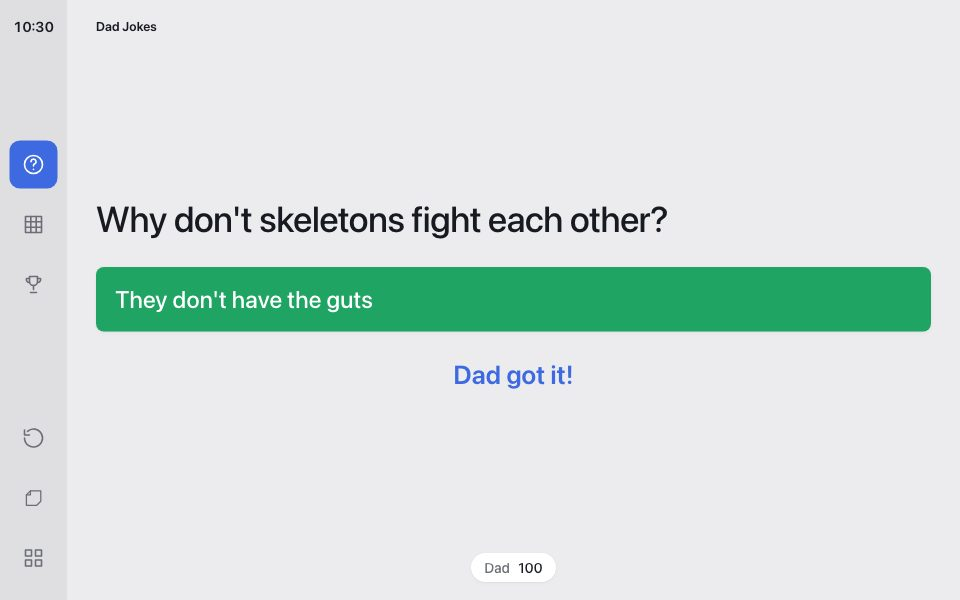</a><br><a href="https://voiceboardgames.com/board/?g=trivia&st=reveal&t=Dad+Jokes&q=Why+don't+skeletons+fight+each+other%3F&a=They+don't+have+the+guts&r=Dad&add=Dad:100">Dad joke round</a></td><td width="50%" valign="top"><a href="https://voiceboardgames.com/board/?g=jeopardy&st=board&cats=70s|80s|90s|00s&v=100|200|300|400|500&p=Mom:0,Dad:0,Kids:0">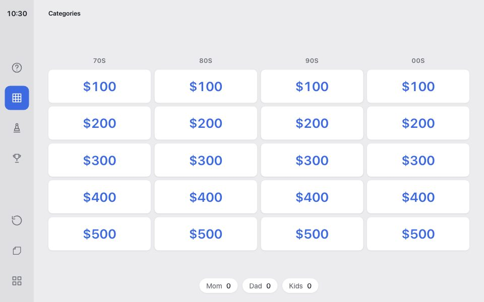</a><br><a href="https://voiceboardgames.com/board/?g=jeopardy&st=board&cats=70s|80s|90s|00s&v=100|200|300|400|500&p=Mom:0,Dad:0,Kids:0">Category board: 70s, 80s, 90s, 00s</a></td></tr>
<tr><td width="50%" valign="top"><a href="https://voiceboardgames.com/board/?g=jeopardy&st=clue&cats=Movie+Quotes|Space|Food|Sports&at=A5&q=%22I'll+be+back%22&dd=1&timer=8&p=Mom:600,Dad:400">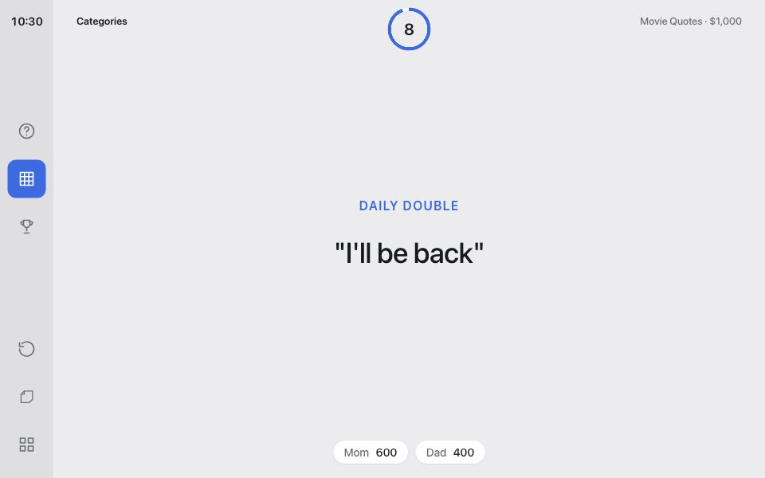</a><br><a href="https://voiceboardgames.com/board/?g=jeopardy&st=clue&cats=Movie+Quotes|Space|Food|Sports&at=A5&q=%22I'll+be+back%22&dd=1&timer=8&p=Mom:600,Dad:400">Movie quotes, Daily Double, mid-countdown</a></td><td width="50%" valign="top"><a href="https://voiceboardgames.com/board/?g=trivia&st=end&t=Animal+Trivia&p=Mia:700,Leo:500,Mom:300&fx=confetti">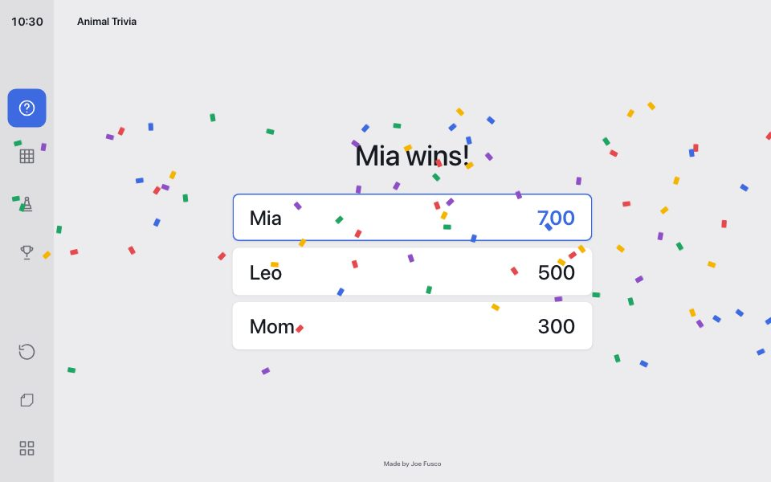</a><br><a href="https://voiceboardgames.com/board/?g=trivia&st=end&t=Animal+Trivia&p=Mia:700,Leo:500,Mom:300&fx=confetti">Kids win: confetti</a></td></tr>
<tr><td width="50%" valign="top"><a href="https://voiceboardgames.com/board/?g=hall"></a><br><a href="https://voiceboardgames.com/board/?g=hall">Hall of Fame</a></td><td></td></tr>
</table>
<!-- examples:end -->

The [assistant instructions](https://voiceboardgames.com/llms.txt) are what a voice assistant reads to learn the format. Opening these links changes the players remembered in your browser, as a real game would.

In the car, say: "Open voiceboardgames.com and host trivia."

The examples live in `docs/examples.json`; `npm run screenshots` retakes every image and rebuilds this gallery.

## Install

On WordPress, download `voiceboard.zip` from the [latest release](../../releases/latest) and upload it under Plugins → Add New. The board is then live at `/board/`, the home page redirects there, and `/llms.txt` serves the assistant instructions, with nothing to configure. To move the board, change the path under Settings → Reading (leave it blank for the site root) or use the filter:

```php
add_filter( 'voiceboard_path', fn () => 'play' );
```

For static hosting, serve the repo root as it is. There's no build step.

## URL format

These work in every game:

| Param | Meaning | Example |
|---|---|---|
| `g` | App: `trivia`, `jeopardy` (or `categories`), `hall`, `home` | `trivia` |
| `st` | Screen, inferred if omitted | `ask` |
| `t` | Title or category | `Space` |
| `p` | Sets the roster, up to 6 players | `Joe:0,Sam:0` |
| `add` | Score changes against the remembered roster | `Sam:100,Joe:-200` |
| `reset` | `1` clears the remembered roster | `1` |
| `timer` | Countdown in seconds, up to 600 | `15` |
| `fx` | Effects | `confetti` |
| `theme` | `tesla` or `cyber`, remembered on the device | `cyber` |
| `lang` | Language for the board's labels on this screen; otherwise the browser's language | `es` |
| `up` | Whose turn it is; highlights that player | `Joe` |
| `code` | Session code the host makes up once per game; enables the transcript | `blue-otter` |

Trivia screens are `ask`, `reveal`, `score`, and `end`. It reads `q` (question), `c` (choices separated by `|`), `a` (the answer as `B`, `2`, or its text), `r` (who got it, or `none`), and `n`/`of` (progress).

The Jeopardy-style game's screens are `board`, `clue`, `reveal`, `final`, and `end`. It reads `cats` (categories separated by `|`), `v` (clue values, 200 to 1000 by default), `u` (used clues such as `A1,C3`), `at` (the chosen clue), `q` (clue), `a` (response), `r` (who got it), `dd` (`1` marks a daily double), and `w` (final wagers).

```
/board/?g=trivia&st=ask&t=Space&n=1&of=5&q=Which+planet+has+the+most+moons%3F&c=Jupiter|Saturn|Uranus|Neptune&p=Joe:0,Sam:0&timer=15
/board/?g=trivia&st=reveal&t=Space&n=1&of=5&q=Which+planet+has+the+most+moons%3F&c=Jupiter|Saturn|Uranus|Neptune&a=B&r=Sam&add=Sam:100
/board/?g=jeopardy&st=board&cats=Space|Rivers|Movies|Food|Sports|Words&u=A1,C3
/board/?g=trivia&st=end&fx=confetti
```

The board tolerates messy input. It decodes values encoded twice, turns bad scores into 0, and opens the home screen for an app it doesn't know. WordPress reserves some query names, so the only overlaps are `p` and `w`, and the plugin tells them apart because the board's values are never numeric.

## Languages

Questions, answers, and names appear in whatever language the assistant sends. The board's own labels come in English, Spanish, French, German, Portuguese, Japanese, Chinese, Arabic, and Hebrew, chosen by `lang=` or else the browser's language, and Arabic and Hebrew switch the layout to right to left. Numbers and times follow the chosen language. To add a language, add its strings to `js/locales.js`.

## Remembered state

The URL decides what's on screen. `localStorage` remembers the roster, so the host can send `add=` instead of every score, along with the last 20 finished games for the Hall of Fame and the theme. Reopening a URL never applies its changes twice, and the board sends none of this to the server.

## Sessions and the URL log

When the plugin serves the board, each screen is reported to WordPress. With `code=blue-otter` in every URL, the site keeps a session the assistant can read back as plain text at `/board/session/blue-otter`: players, scores, what's on screen, and every question asked so far. Sessions live in a `voiceboard_session` post type under Tools → Voiceboard sessions, where each one also shows a log of the exact URLs the screen received and anything the board had to fix (unknown parameters, double encoding, an unknown screen). Without a code, a board still gets its own session named after its random car ID. Sessions are deleted after 30 days.

If the [Presence API](https://github.com/WordPress/presence-api) plugin is active, each board also appears in a `voiceboard/session/<code>` room and a `voiceboard/cars` room while it's open. Static hosting sends nothing.

The plugin registers three abilities for MCP-capable assistants: `voiceboard/get-instructions`, `voiceboard/build-url`, and `voiceboard/get-transcript`.

## How an assistant learns the format

The instructions live in one file, `llms.txt`, and the plugin publishes them with the site's own board URL filled in. They're served at `/llms.txt` and embedded in the board's HTML for assistants that read pages without running JavaScript. Because the home page redirects to the board and keeps any parameters, "open example.com and host trivia" reaches the instructions too, and the board shows people that same sentence with its own domain. A test fails if any parameter goes undocumented.

## Structure

```
voiceboard.php           core plugin: board, routes, settings, module loading
includes/modules.php     module registry, import map, bundled module loader
includes/screens.php     screen reports: /voiceboard/v1/ping and bye, validation, rate limits, hooks
includes/hardening.php   security headers on Voiceboard's responses
index.html               board shell (the plugin fills in modules and embeds llms.txt)
llms.txt                 core assistant instructions; each module adds its own section
board.css                light/dark and Cyber themes, sidebar, screens, effects
js/voiceboard.js         the public API modules import as 'voiceboard'
js/main.js               boot: URL -> modules -> app -> remembered state -> screen -> effects -> report
js/registry.js           keyed registries for apps and effects
js/params.js             typed param parsers and readParams(search, schema)
js/dom.js                h() element builder, icons, app links
js/screens.js            shared header, score strip, scoreboard, idle and next screens
js/store.js              localStorage roster, history, device preferences, car ID
js/i18n.js               language choice, t() for labels, addStrings() for modules
js/locales.js            core label translations
js/dock.js               sidebar
js/report.js             reports each screen to the plugin
js/apps/                 built-in Home and Hall of Fame
plugins/                 modules: each folder is a plugin (see plugins/README.md)
```

Every game, effect, and server feature lives in `plugins/` and is built only on the public JavaScript API and the core's PHP hooks. [plugins/README.md](plugins/README.md) explains how to write one and lists every hook.

## Development

```sh
npm install
npx playwright install chromium
npm test              # whole suite against static files and the plugin in WordPress Playground
npm run test:static   # static only, fastest
npm run serve         # static preview on :8766
npm run wp            # WordPress + plugin on :9400, board at /board/
npm run wp:root       # board at the site root with the site theme, on :9401
```

Every push to `main` that passes the tests deploys. Release-please reads conventional commits (`feat:`, `fix:`) and opens a release PR; merging it tags the version, updates `CHANGELOG.md` and the plugin header, and attaches `voiceboard.zip`. Issue labels follow the WordPress/presence-api scheme (`[Type]`, `[Area]`, and workflow labels).
