# Voiceboard

Game boards for in-car voice assistants. You talk to the assistant, it opens a URL, and the screen shows the game. Trivia, a Jeopardy-style board, and chess so far.

In the car, say: "Open voiceboardgames.com and host trivia."

## Examples

Each of these is one URL. Opening them changes the players saved in your browser.

<!-- examples:start -->
<table>
<tr><td width="50%" valign="top"><a href="https://voiceboardgames.com/board/">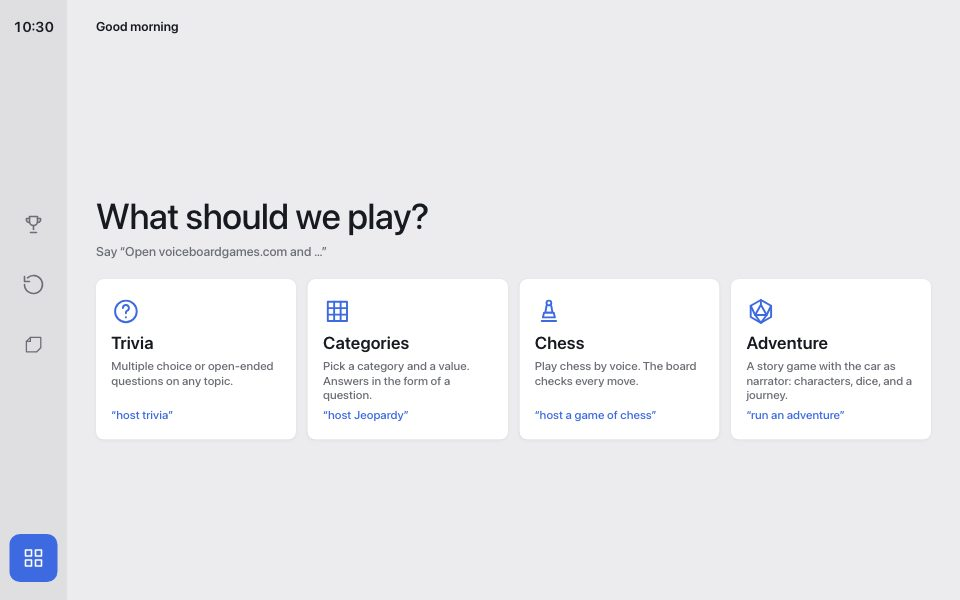</a> <a href="https://voiceboardgames.com/board/">Home screen</a></td><td width="50%" valign="top"><a href="https://voiceboardgames.com/board/?g=trivia&st=ask&t=Space&n=3&of=10&q=Which+planet+has+the+most+known+moons%3F&c=Jupiter|Saturn|Uranus|Neptune&p=Joe:200,Sam:100&timer=15">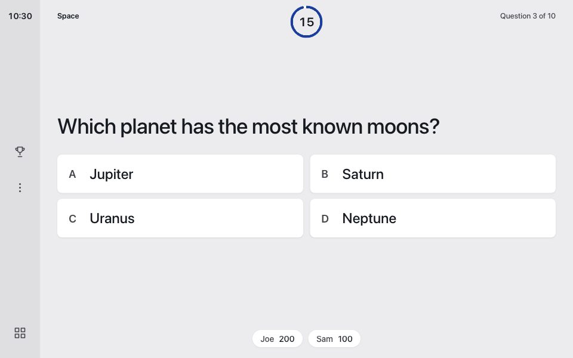</a> <a href="https://voiceboardgames.com/board/?g=trivia&st=ask&t=Space&n=3&of=10&q=Which+planet+has+the+most+known+moons%3F&c=Jupiter|Saturn|Uranus|Neptune&p=Joe:200,Sam:100&timer=15">Trivia question with a countdown</a></td></tr>
<tr><td width="50%" valign="top"><a href="https://voiceboardgames.com/board/?g=trivia&st=reveal&t=Space&n=3&of=10&q=Which+planet+has+the+most+known+moons%3F&c=Jupiter|Saturn|Uranus|Neptune&a=B&r=Sam&p=Joe:200,Sam:200">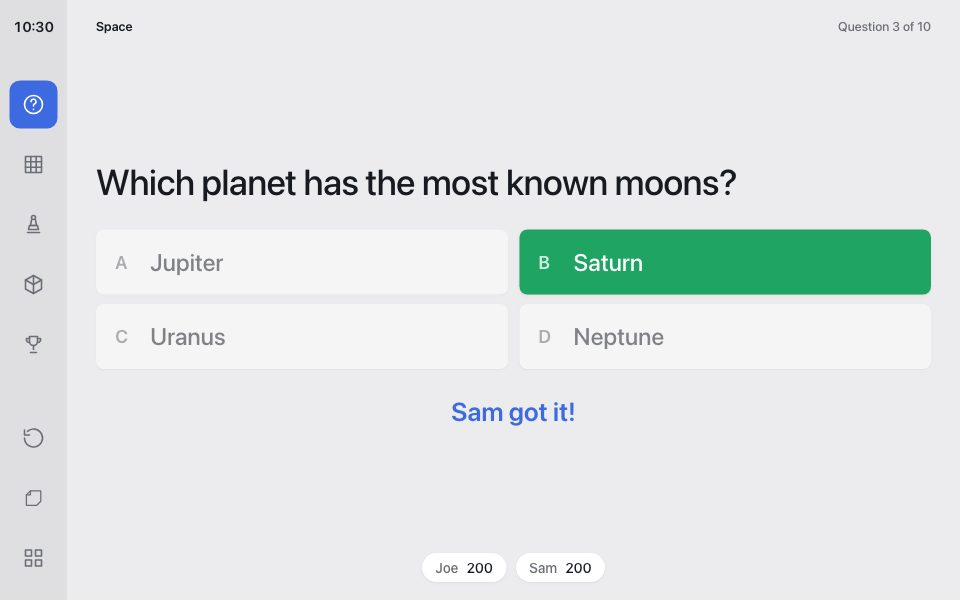</a> <a href="https://voiceboardgames.com/board/?g=trivia&st=reveal&t=Space&n=3&of=10&q=Which+planet+has+the+most+known+moons%3F&c=Jupiter|Saturn|Uranus|Neptune&a=B&r=Sam&p=Joe:200,Sam:200">Sam gets it right</a></td><td width="50%" valign="top"><a href="https://voiceboardgames.com/board/?g=trivia&st=next&up=Joe&t=Space&n=4&of=10&p=Joe:200,Sam:300,Ava:100">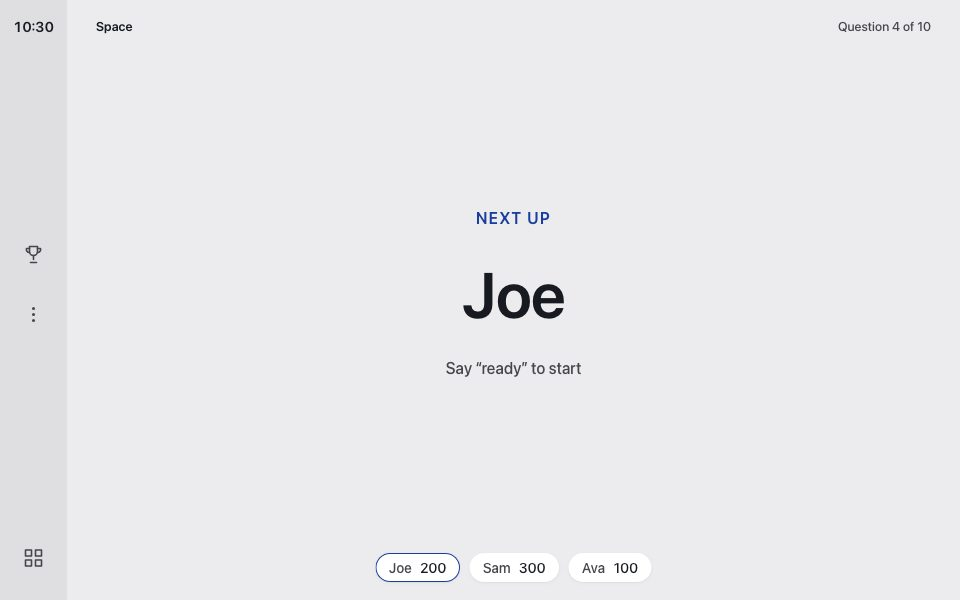</a> <a href="https://voiceboardgames.com/board/?g=trivia&st=next&up=Joe&t=Space&n=4&of=10&p=Joe:200,Sam:300,Ava:100">Next up is Joe</a></td></tr>
<tr><td width="50%" valign="top"><a href="https://voiceboardgames.com/board/?g=trivia&st=ask&lang=es&t=Arte&n=2&of=5&q=¿Quién+pintó+la+Mona+Lisa%3F&c=Leonardo+da+Vinci|Miguel+Ángel|Rafael|Botticelli&up=Lucía&p=Lucía:100,Mateo:200&timer=15">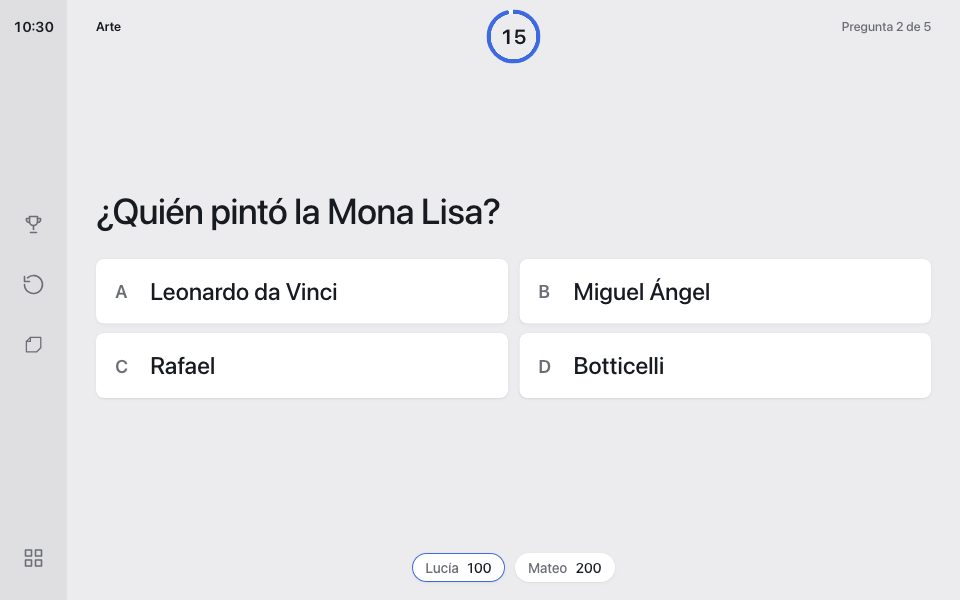</a> <a href="https://voiceboardgames.com/board/?g=trivia&st=ask&lang=es&t=Arte&n=2&of=5&q=¿Quién+pintó+la+Mona+Lisa%3F&c=Leonardo+da+Vinci|Miguel+Ángel|Rafael|Botticelli&up=Lucía&p=Lucía:100,Mateo:200&timer=15">Trivia in Spanish</a></td><td width="50%" valign="top"><a href="https://voiceboardgames.com/board/?g=trivia&st=reveal&lang=ar&t=الفضاء&q=ما+هو+أكبر+كوكب+في+المجموعة+الشمسية؟&c=المشتري|زحل|الأرض|المريخ&a=A&r=سارة&p=سارة:300,عمر:200">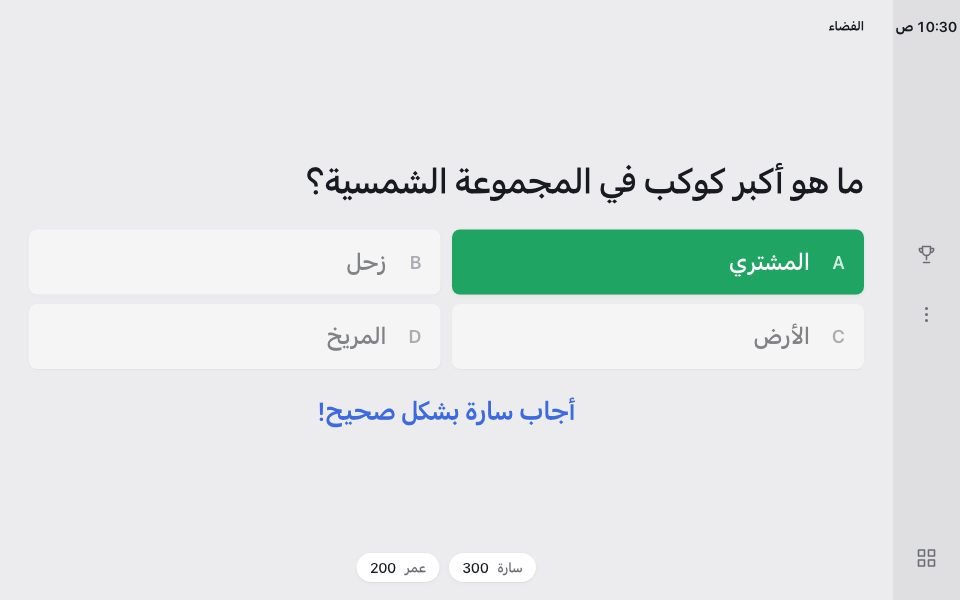</a> <a href="https://voiceboardgames.com/board/?g=trivia&st=reveal&lang=ar&t=الفضاء&q=ما+هو+أكبر+كوكب+في+المجموعة+الشمسية؟&c=المشتري|زحل|الأرض|المريخ&a=A&r=سارة&p=سارة:300,عمر:200">Arabic, laid out right to left</a></td></tr>
<tr><td width="50%" valign="top"><a href="https://voiceboardgames.com/board/?g=jeopardy&st=board&lang=ja&cats=宇宙|日本の歴史|アニメ|食べ物&u=A1,C2&at=B3&p=ハル:400,ユキ:200">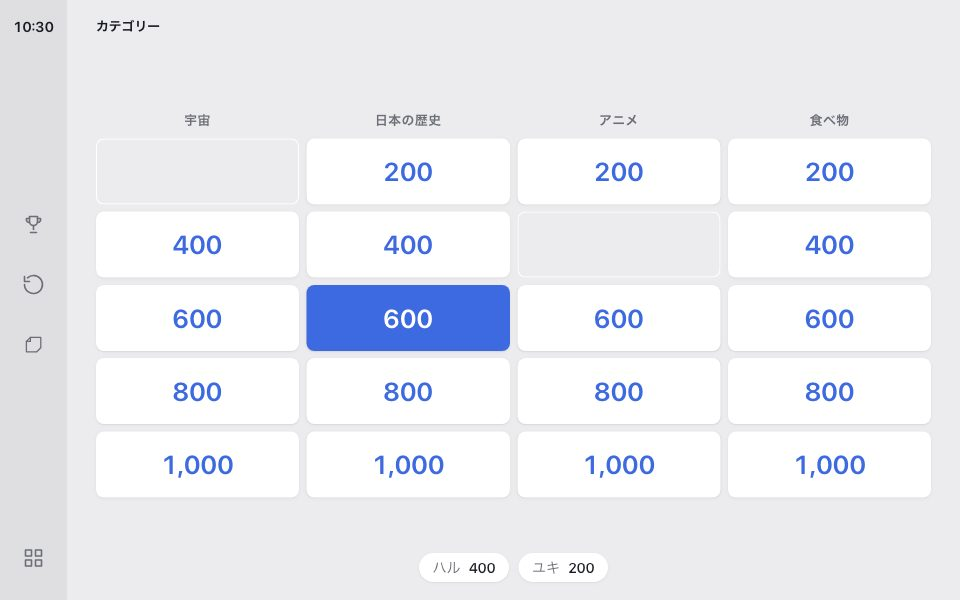</a> <a href="https://voiceboardgames.com/board/?g=jeopardy&st=board&lang=ja&cats=宇宙|日本の歴史|アニメ|食べ物&u=A1,C2&at=B3&p=ハル:400,ユキ:200">Category board in Japanese</a></td><td width="50%" valign="top"><a href="https://voiceboardgames.com/board/?g=trivia&st=ask&t=Emoji+Movies&q=🦁👑&c=The+Lion+King|Madagascar|Zootopia|Tarzan&timer=20">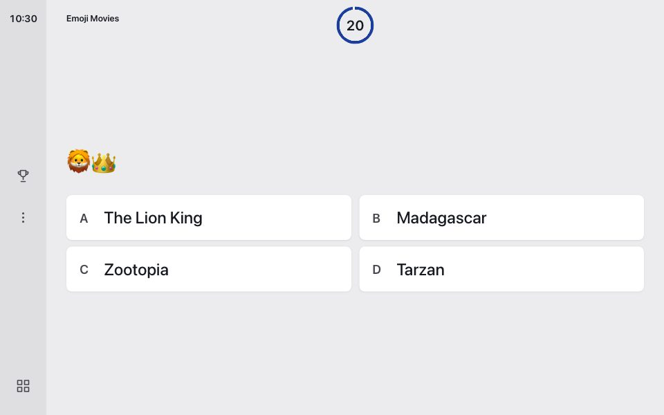</a> <a href="https://voiceboardgames.com/board/?g=trivia&st=ask&t=Emoji+Movies&q=🦁👑&c=The+Lion+King|Madagascar|Zootopia|Tarzan&timer=20">Name the movie from emoji</a></td></tr>
<tr><td width="50%" valign="top"><a href="https://voiceboardgames.com/board/?g=trivia&st=reveal&t=History&q=Who+was+the+first+person+in+space%3F&a=Yuri+Gagarin&r=none&p=Joe:300,Sam:300">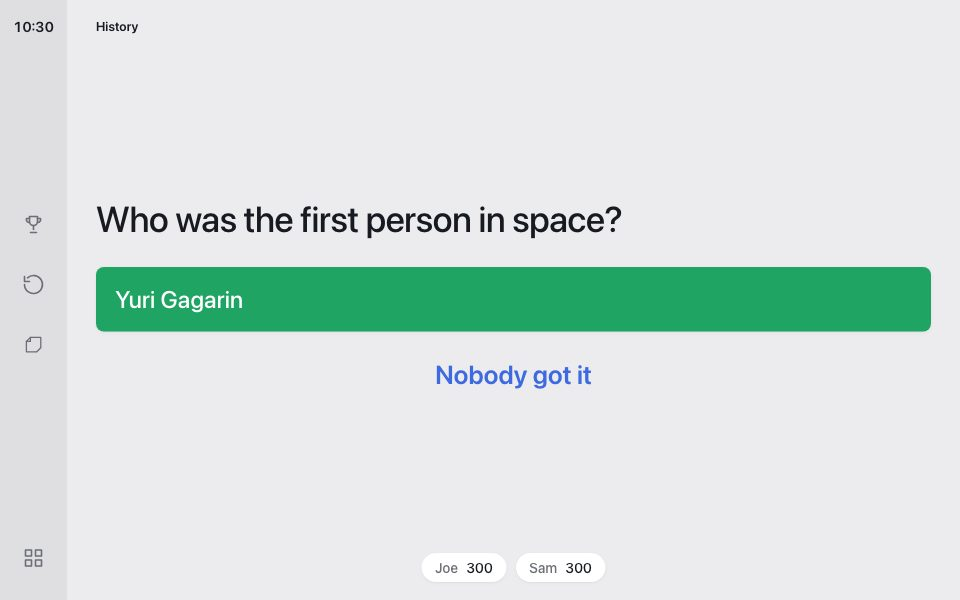</a> <a href="https://voiceboardgames.com/board/?g=trivia&st=reveal&t=History&q=Who+was+the+first+person+in+space%3F&a=Yuri+Gagarin&r=none&p=Joe:300,Sam:300">Nobody got this one</a></td><td width="50%" valign="top"><a href="https://voiceboardgames.com/board/?g=jeopardy&st=board&cats=Space|Rivers|80s+Movies|Food|Sports|Words&u=A1,C3,F5,B2&at=D4&p=Joe:400,Sam:-200,Ava:1200">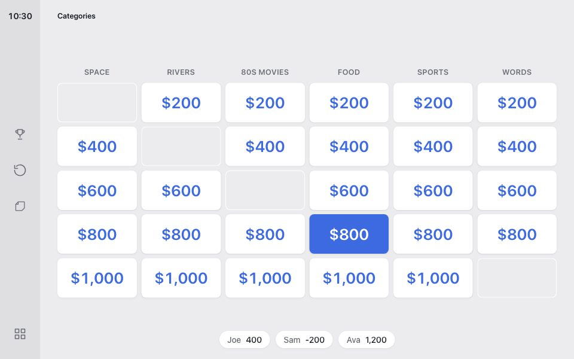</a> <a href="https://voiceboardgames.com/board/?g=jeopardy&st=board&cats=Space|Rivers|80s+Movies|Food|Sports|Words&u=A1,C3,F5,B2&at=D4&p=Joe:400,Sam:-200,Ava:1200">Category board mid-game</a></td></tr>
<tr><td width="50%" valign="top"><a href="https://voiceboardgames.com/board/?g=jeopardy&st=clue&cats=Space|Rivers|80s+Movies|Food|Sports|Words&at=B3&q=This+river+flows+through+Cairo&dd=1&timer=10&p=Joe:400,Sam:-200,Ava:1200">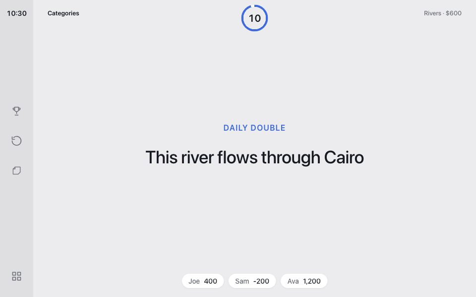</a> <a href="https://voiceboardgames.com/board/?g=jeopardy&st=clue&cats=Space|Rivers|80s+Movies|Food|Sports|Words&at=B3&q=This+river+flows+through+Cairo&dd=1&timer=10&p=Joe:400,Sam:-200,Ava:1200">Daily Double</a></td><td width="50%" valign="top"><a href="https://voiceboardgames.com/board/?g=jeopardy&st=final&t=Final+Jeopardy&q=This+planet+has+the+tallest+volcano+in+the+solar+system&a=What+is+Mars%3F&r=Ava&w=Joe:400,Ava:1200&p=Joe:0,Ava:2400">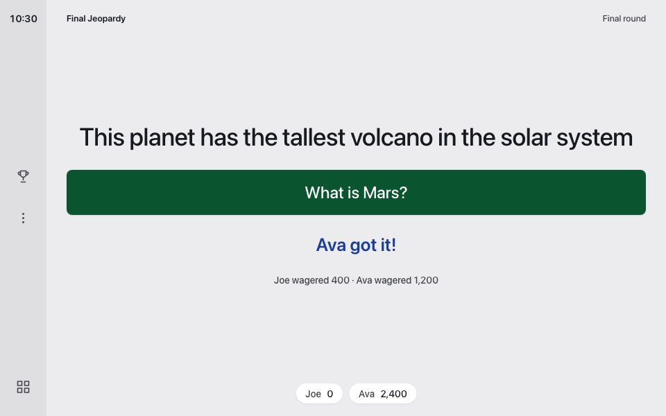</a> <a href="https://voiceboardgames.com/board/?g=jeopardy&st=final&t=Final+Jeopardy&q=This+planet+has+the+tallest+volcano+in+the+solar+system&a=What+is+Mars%3F&r=Ava&w=Joe:400,Ava:1200&p=Joe:0,Ava:2400">Final round with wagers</a></td></tr>
<tr><td width="50%" valign="top"><a href="https://voiceboardgames.com/board/?g=trivia&st=end&t=Road+Trip+Trivia&p=Joe:500,Sam:500,Ava:300">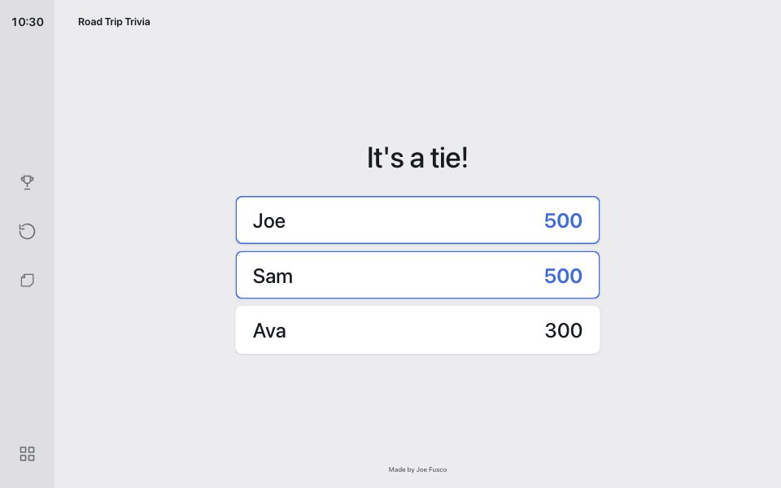</a> <a href="https://voiceboardgames.com/board/?g=trivia&st=end&t=Road+Trip+Trivia&p=Joe:500,Sam:500,Ava:300">A tie</a></td><td width="50%" valign="top"><a href="https://voiceboardgames.com/board/?g=trivia&st=end&t=Space&p=Joe:300,Sam:500,Ava:400,Max:250,Lee:450,Kim:100&fx=confetti">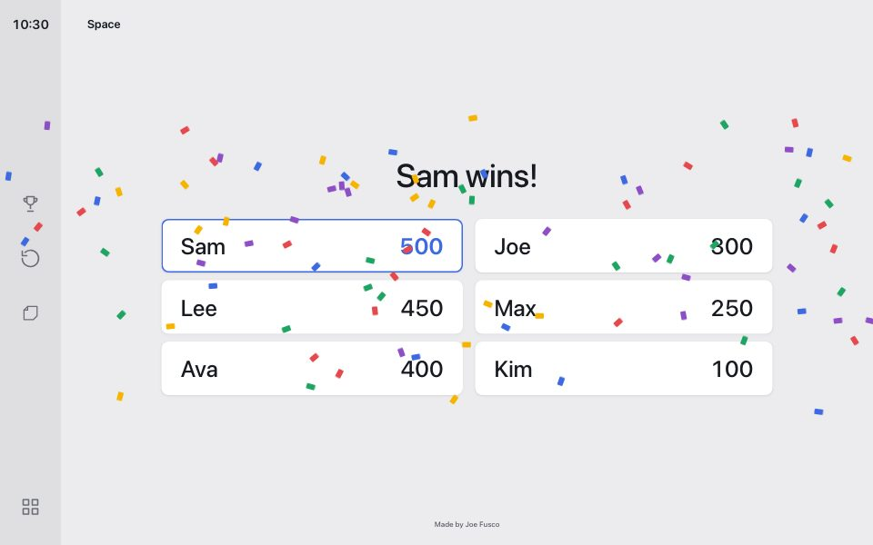</a> <a href="https://voiceboardgames.com/board/?g=trivia&st=end&t=Space&p=Joe:300,Sam:500,Ava:400,Max:250,Lee:450,Kim:100&fx=confetti">Six players and confetti</a></td></tr>
<tr><td width="50%" valign="top"><a href="https://voiceboardgames.com/board/?g=jeopardy&st=board&cats=Robots|Space|Synthwave|Hackers|Neon|Future&u=A1,D2&at=C3&p=Neo:800,Trinity:1200,Morpheus:400&theme=cyber">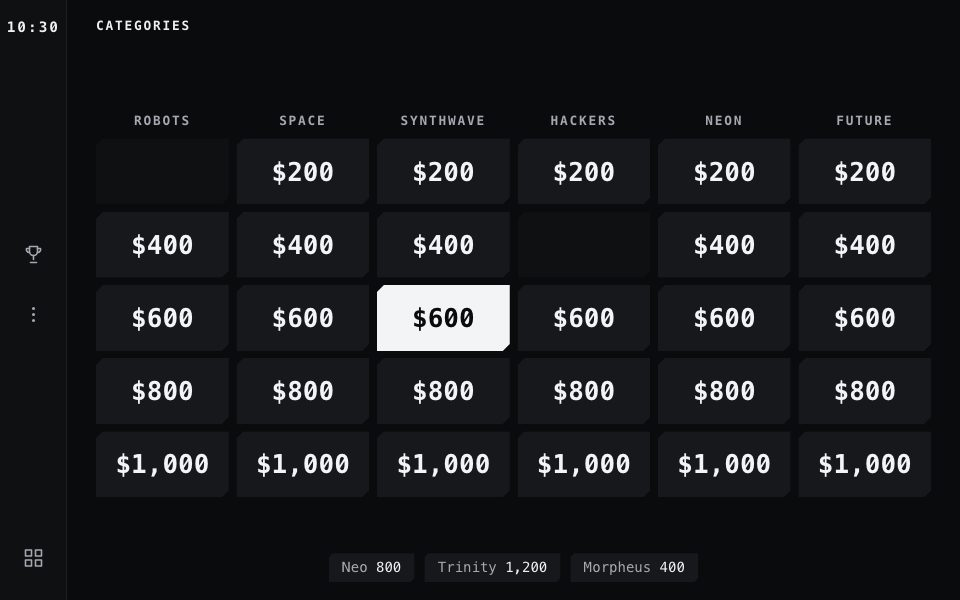</a> <a href="https://voiceboardgames.com/board/?g=jeopardy&st=board&cats=Robots|Space|Synthwave|Hackers|Neon|Future&u=A1,D2&at=C3&p=Neo:800,Trinity:1200,Morpheus:400&theme=cyber">Category board in the Cyber theme</a></td><td width="50%" valign="top"><a href="https://voiceboardgames.com/board/?g=chess&p=Joe:0,Sam:0&mv=e4+e5+Nf3+Nc6+Bc4+Nf6">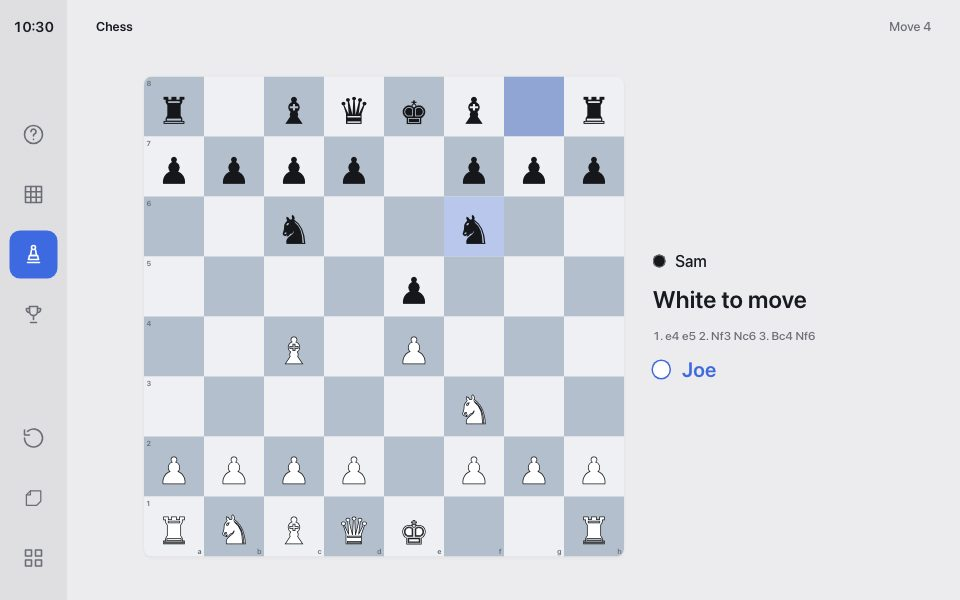</a> <a href="https://voiceboardgames.com/board/?g=chess&p=Joe:0,Sam:0&mv=e4+e5+Nf3+Nc6+Bc4+Nf6">Chess, a few moves in</a></td></tr>
<tr><td width="50%" valign="top"><a href="https://voiceboardgames.com/board/?g=chess&p=Joe:0,Sam:0&mv=e4+e5+Qh5+Nc6+Bc4+Nf6+Qxf7">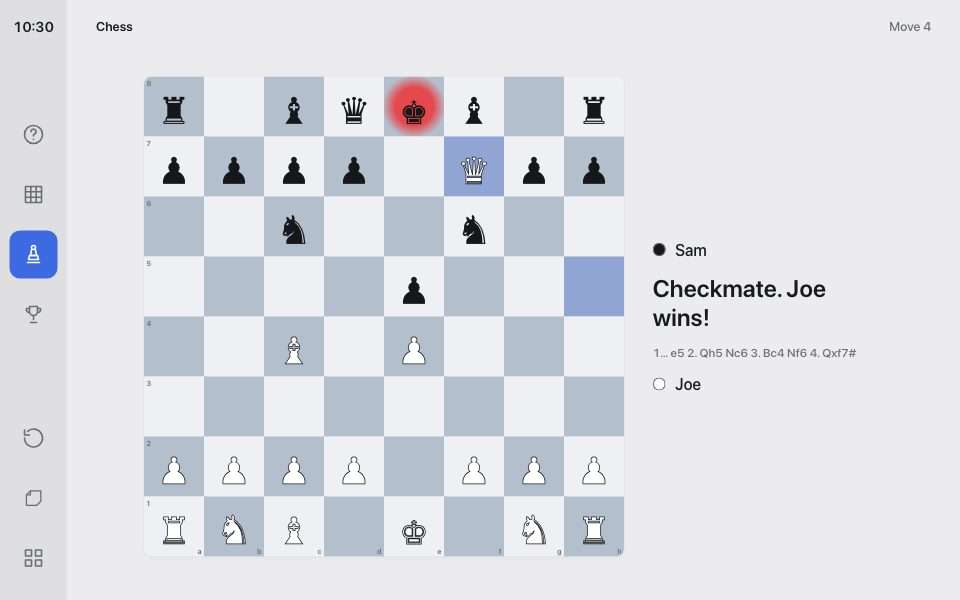</a> <a href="https://voiceboardgames.com/board/?g=chess&p=Joe:0,Sam:0&mv=e4+e5+Qh5+Nc6+Bc4+Nf6+Qxf7">Scholar's mate</a></td><td width="50%" valign="top"><a href="https://voiceboardgames.com/board/?g=chess&side=b&theme=cyber&p=Neo:0,Trinity:0&mv=d4+d5+c4+e6+Nc3+Nf6">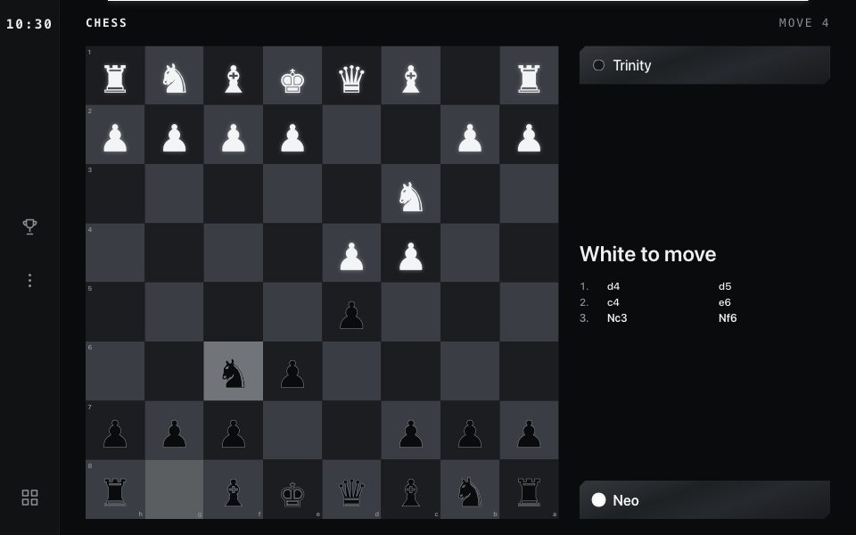</a> <a href="https://voiceboardgames.com/board/?g=chess&side=b&theme=cyber&p=Neo:0,Trinity:0&mv=d4+d5+c4+e6+Nc3+Nf6">Chess from Black's side, Cyber theme</a></td></tr>
<tr><td width="50%" valign="top"><a href="https://voiceboardgames.com/board/?g=home&theme=cyber">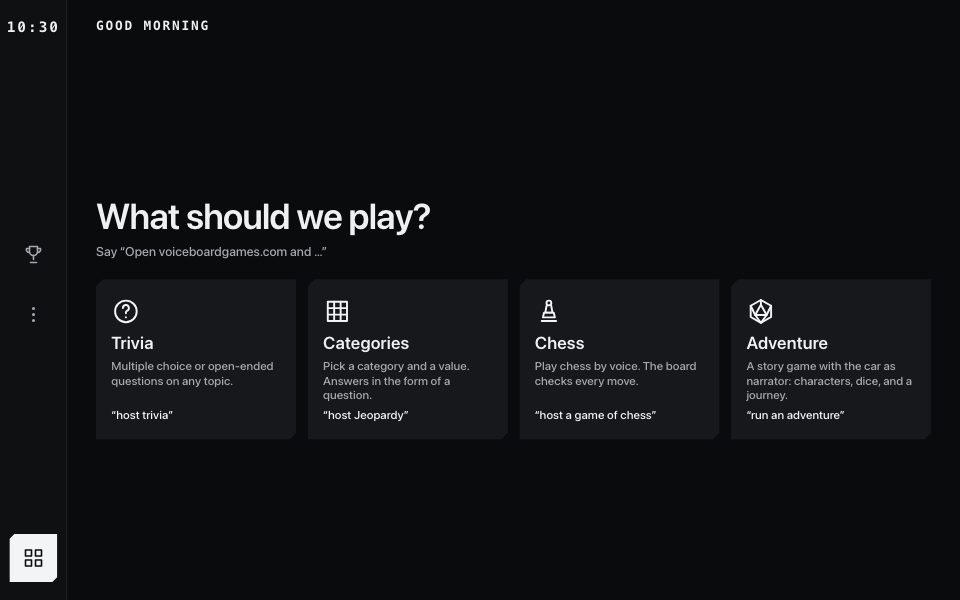</a> <a href="https://voiceboardgames.com/board/?g=home&theme=cyber">Home screen, Cyber theme</a></td><td width="50%" valign="top"><a href="https://voiceboardgames.com/board/?g=trivia&st=ask&t=Night+Sky&n=2&of=8&q=Which+star+is+closest+to+Earth%3F&c=Sirius|The+Sun|Proxima+Centauri|Polaris&p=Joe:100,Sam:200&timer=15">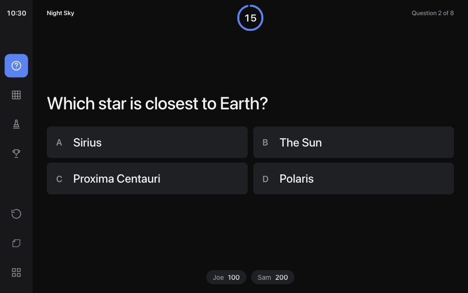</a> <a href="https://voiceboardgames.com/board/?g=trivia&st=ask&t=Night+Sky&n=2&of=8&q=Which+star+is+closest+to+Earth%3F&c=Sirius|The+Sun|Proxima+Centauri|Polaris&p=Joe:100,Sam:200&timer=15">Trivia in dark mode</a></td></tr>
<tr><td width="50%" valign="top"><a href="https://voiceboardgames.com/board/?g=trivia&st=next&up=Trinity&t=Hackers&n=6&of=12&p=Neo:500,Trinity:400,Morpheus:300,Tank:200,Dozer:100,Switch:0&theme=cyber">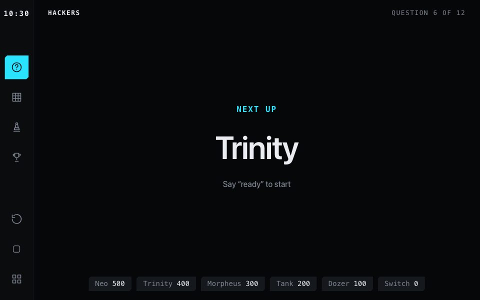</a> <a href="https://voiceboardgames.com/board/?g=trivia&st=next&up=Trinity&t=Hackers&n=6&of=12&p=Neo:500,Trinity:400,Morpheus:300,Tank:200,Dozer:100,Switch:0&theme=cyber">Six players, Cyber theme</a></td><td width="50%" valign="top"><a href="https://voiceboardgames.com/board/?g=trivia&st=end&lang=he&t=טריוויה&p=נועה:500,יונתן:300,מאיה:400&fx=confetti">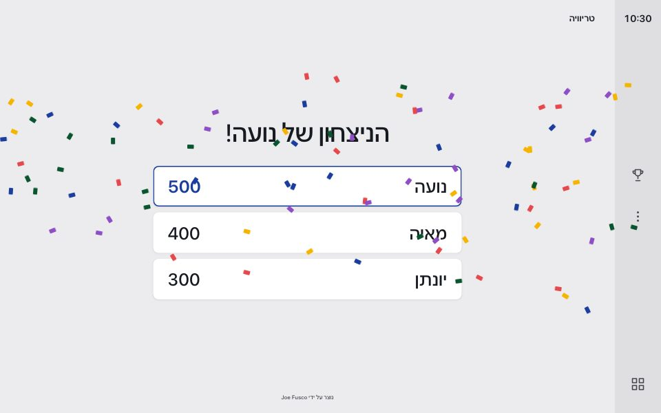</a> <a href="https://voiceboardgames.com/board/?g=trivia&st=end&lang=he&t=טריוויה&p=נועה:500,יונתן:300,מאיה:400&fx=confetti">Final scores in Hebrew</a></td></tr>
<tr><td width="50%" valign="top"><a href="https://voiceboardgames.com/board/?g=jeopardy&st=final&lang=fr&t=Finale&q=Ce+monument+parisien+mesure+330+m%C3%A8tres&a=Qu%27est-ce+que+la+tour+Eiffel+%3F&r=Camille&w=Camille:800,Louis:400&p=Camille:2400,Louis:1600">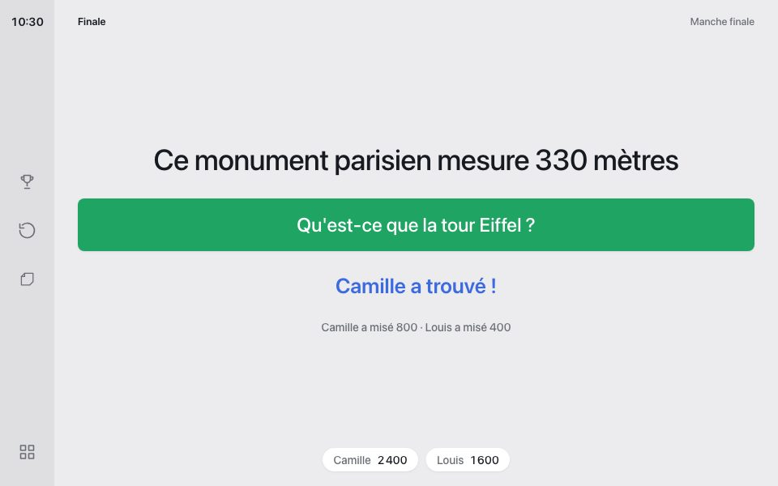</a> <a href="https://voiceboardgames.com/board/?g=jeopardy&st=final&lang=fr&t=Finale&q=Ce+monument+parisien+mesure+330+m%C3%A8tres&a=Qu%27est-ce+que+la+tour+Eiffel+%3F&r=Camille&w=Camille:800,Louis:400&p=Camille:2400,Louis:1600">Final round in French</a></td><td width="50%" valign="top"><a href="https://voiceboardgames.com/board/?g=trivia&st=reveal&lang=de&t=Geschichte&q=Wer+erfand+den+Buchdruck+mit+beweglichen+Lettern%3F&a=Johannes+Gutenberg&r=Lena&p=Lena:300,Max:200">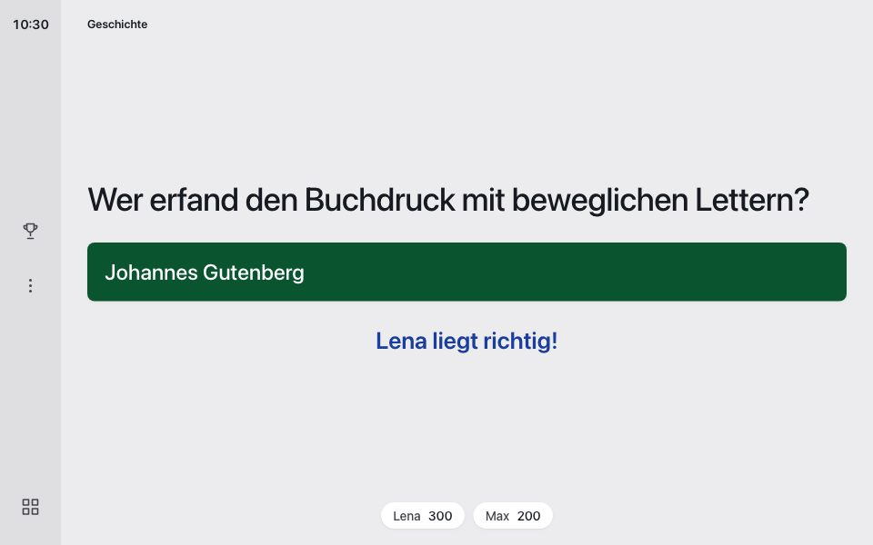</a> <a href="https://voiceboardgames.com/board/?g=trivia&st=reveal&lang=de&t=Geschichte&q=Wer+erfand+den+Buchdruck+mit+beweglichen+Lettern%3F&a=Johannes+Gutenberg&r=Lena&p=Lena:300,Max:200">Open-ended answer in German</a></td></tr>
<tr><td width="50%" valign="top"><a href="https://voiceboardgames.com/board/?g=hall">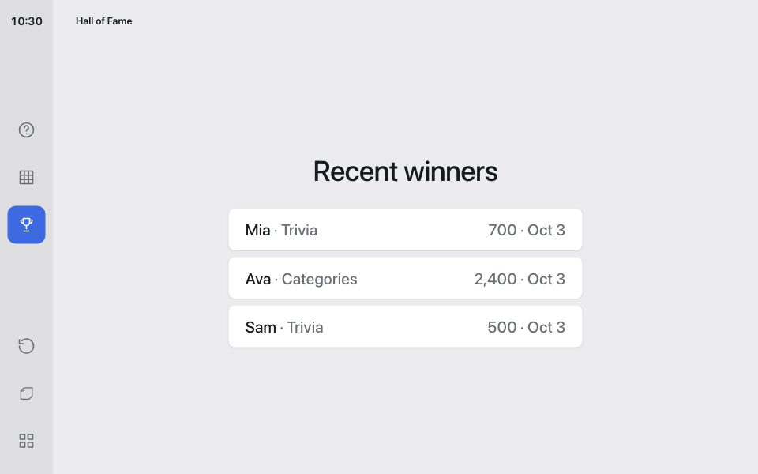</a> <a href="https://voiceboardgames.com/board/?g=hall">Hall of Fame</a></td><td></td></tr>
</table>
<!-- examples:end -->

## Install

Download `voiceboard.zip` from the [latest release](../../releases/latest) and upload it in WordPress under Plugins → Add New. The board lives at `/board/` and the home page redirects to it.

Board labels come in English, Spanish, French, German, Portuguese, Japanese, Chinese, Arabic, and Hebrew.

## Docs

- [llms.txt](llms.txt) is the URL format. It's written for assistants, and it's the full parameter reference.
- [plugins/README.md](plugins/README.md) explains how to add a game.
- [CONTRIBUTING.md](CONTRIBUTING.md) covers the code layout, tests, and releases.
- [DECISIONS.md](DECISIONS.md) is the decision log.

## License

GPL-3.0-or-later with additional terms. See [LICENSE](LICENSE).
