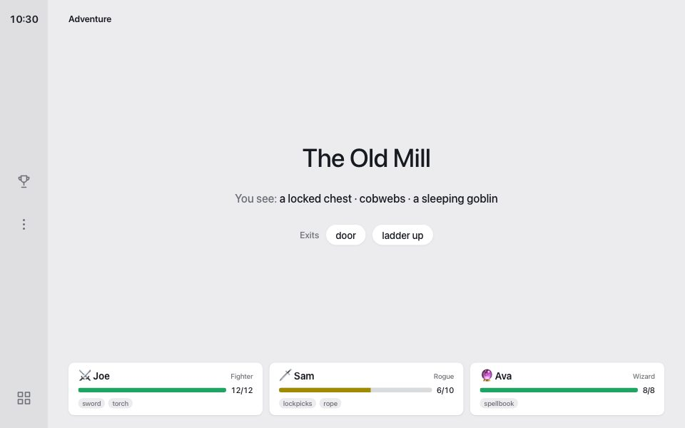
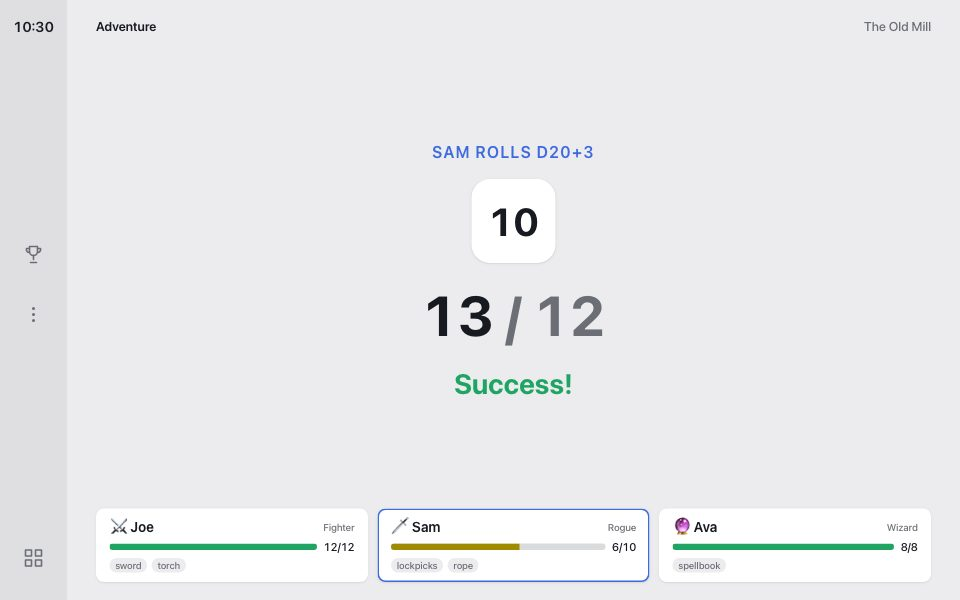

# Voiceboard

Voiceboard turns a car's screen into a game board that your voice assistant runs. You ask the assistant to host a game, and it updates the screen by opening links. There's trivia, a Jeopardy-style board, chess, and a story adventure with dice.

In the car, say: "Read voiceboardgames.com/rules, then host trivia."

The assistant reads the rules, then puts the game on the car's screen. Opening `/rules` in a browser shows the board.

Play while parked, or let passengers play. Most cars lock the browser while driving. Your assistant needs to be able to open websites in the car's browser, and some cars only allow that on newer hardware.

## Examples

Each picture links to the live screen. Opening one updates the players saved in your browser. The [gallery](docs/gallery.md) has every example.

<!-- examples:start -->
<table>
<tr><td width="50%" valign="top"> <a href="https://voiceboardgames.com/board/?g=trivia&st=ask&t=Space&n=3&of=10&q=Which+planet+has+the+most+known+moons%3F&c=Jupiter|Saturn|Uranus|Neptune&p=Joe:200,Sam:100&timer=15">Trivia question with a countdown</a></td><td width="50%" valign="top"> <a href="https://voiceboardgames.com/board/?g=trivia&st=reveal&lang=ar&t=الفضاء&q=ما+هو+أكبر+كوكب+في+المجموعة+الشمسية؟&c=المشتري|زحل|الأرض|المريخ&a=A&r=سارة&p=سارة:300,عمر:200">Arabic, laid out right to left</a></td></tr>
<tr><td width="50%" valign="top"> <a href="https://voiceboardgames.com/board/?g=jeopardy&st=board&cats=Space|Rivers|80s+Movies|Food|Sports|Words&u=A1,C3,F5,B2&at=D4&p=Joe:400,Sam:-200,Ava:1200">Category board mid-game</a></td><td width="50%" valign="top"> <a href="https://voiceboardgames.com/board/?g=jeopardy&st=clue&cats=Space|Rivers|80s+Movies|Food|Sports|Words&at=B3&q=This+river+flows+through+Cairo&dd=1&timer=10&p=Joe:400,Sam:-200,Ava:1200">Daily Double</a></td></tr>
<tr><td width="50%" valign="top"> <a href="https://voiceboardgames.com/board/?g=trivia&st=end&t=Space&p=Joe:300,Sam:500,Ava:400,Max:250,Lee:450,Kim:100&fx=confetti">Six players and confetti</a></td><td width="50%" valign="top"> <a href="https://voiceboardgames.com/board/?g=jeopardy&st=board&cats=Robots|Space|Synthwave|Hackers|Neon|Future&u=A1,D2&at=C3&p=Neo:800,Trinity:1200,Morpheus:400&theme=cyber">Category board in the Cyber theme</a></td></tr>
<tr><td width="50%" valign="top"> <a href="https://voiceboardgames.com/board/?g=adventure&code=readme&ch=Joe:fighter:12/12,Sam:rogue:6/10,Ava:wizard:8/8&inv=Joe:sword|torch;Sam:lockpicks|rope;Ava:spellbook&loc=The+Old+Mill&see=a+locked+chest|cobwebs|a+sleeping+goblin&ex=door|ladder+up">Adventure scene with the party</a></td><td width="50%" valign="top"> <a href="https://voiceboardgames.com/board/?g=adventure&code=readme&ch=Joe:fighter:12/12,Sam:rogue:6/10,Ava:wizard:8/8&inv=Joe:sword|torch;Sam:lockpicks|rope;Ava:spellbook&loc=The+Old+Mill&roll=d20%2B3&for=Sam&vs=12&rn=1">Sam rolls to pick the lock</a></td></tr>
</table>
<!-- examples:end -->

## Install

Voiceboard is a WordPress plugin. Download `voiceboard.zip` from the [latest release](../../releases/latest), then upload it under Plugins → Add New. The board appears at `/board/`, and your home page sends visitors there.

The board's labels are available in English, Spanish, French, German, Portuguese, Japanese, Chinese, Arabic, and Hebrew.

## Docs

- [llms.txt](llms.txt) describes every URL parameter. Assistants read it to learn the games.
- [plugins/README.md](plugins/README.md) explains how to add a game.
- [CONTRIBUTING.md](CONTRIBUTING.md) covers the code layout, tests, and releases.

## License

GPL-3.0-or-later with additional terms. See [LICENSE](LICENSE).
